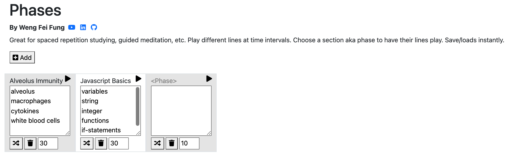

# Phases

  

:page_facing_up: Description:
---
By Weng Fei Fung. Great for spaced repetition studying, guided meditation, etc. Play different lines at time intervals. Choose a section aka phase to have their lines play. Save/loads instantly.

:open_file_folder: Table of Contents:
---
- [Description](#page-facing-up-description)
- [Preview](#camera-preview)
- [Installation and Usage](#minidisc-installation-and-usage)

:computer: Live Deployment:
---
<a href="https://wengindustry.com/tools/sp/phases" target="_blank">Check it out</a>

:camera: Preview:
---

## :minidisc: Installation and Usage:
Run as a HTML file or server file. No needed hands-on setup.